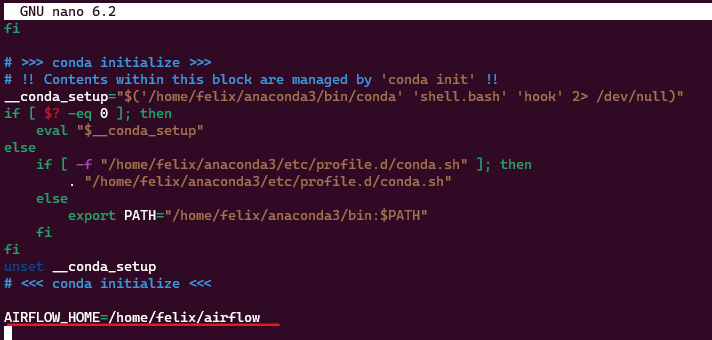
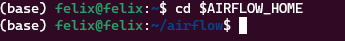
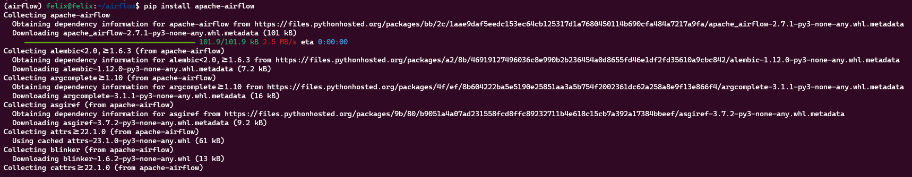
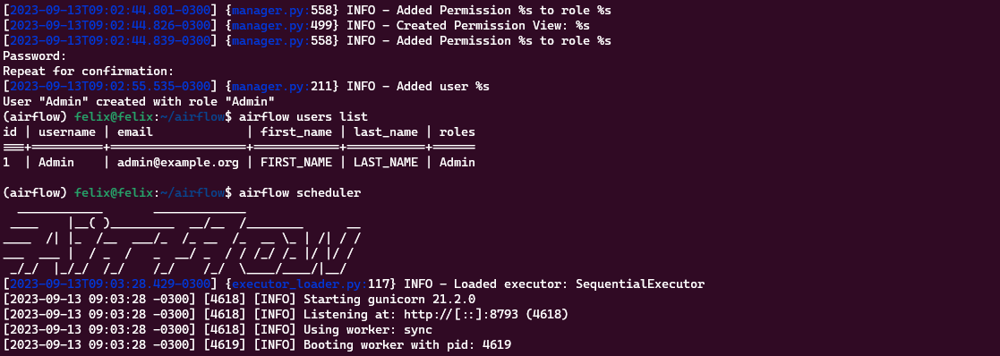

# Learn Airflow by doing

This repository is intended to store information regarding Airflow settings and tutorials.

## Quick start book:

* [Data_Pipelines_with_Apache_Airflow](https://biconsult.ru/files/Data_warehouse/Bas_P_Harenslak%2C_Julian_Rutger_de_Ruiter_Data_Pipelines_with_Apache.pdf)

## Airflow Official Documentation

* [Apache_Airflow](https://airflow.apache.org/docs/apache-airflow/stable/index.html)

## Airflow GitHub Repo

* [GitHub Repo](https://github.com/BasPH/data-pipelines-with-apache-airflow/tree/master)

### First steps

Installing Airflow in WSL2

* Prerequisites: This step-by-step assumes that you're familiar with using the command line and can set up your development environment as directed.
* Set Up the Virtual Environment: If you have Anaconda installed in your system, first go to your home directory `cd ~` then run `conda create -c conda-forge -n airflow python=3.11 pyarrow` in order to create a virtual environment named **airflow** with python 3.11 and pyarrow installed.
* Then activate your environment by running `conda activate airflow`
* Set Up the Airflow Directory: Create the folder called **airflow** in your home directory by running `mkdir airflow`, then set that directory into your env variables by `nano ~/.bashrc`, in the last line of that file include `AIRFLOW_HOME=/home/[YourUsername]/airflow`, then press Ctrl+X and save changes, then source them `source ~/.bashrc` in order to set the changes in the **bashrc** file, after that in order to check that the env variable was set successfully just run `cd $AIRFLOW_HOME` like in the screeshot bellow.
   
  Adding AIRFLOW_HOME to bashrc
  

  Checking that the env variable was set successfully
  
  
* Install Apache Airflow: In order to install airflow in your virtual environment run `pip install apache-airflow`, but before that check that you are under the conda virtual env, then you will need to initialize the database by running `airflow db init` . After that you will need to create a folder called **dags** in your airflow directory, this folder will store your airflow [dags](https://airflow.apache.org/docs/apache-airflow/stable/core-concepts/dags.html) that just definesthwe Tasks and dictates the order in which they have to run, generally are python scripts.
    
  Installing Airflow in virtual environment
  

* Create an Airflow User: In this step you'll need to create a user. This user will be used to login into the Airflow UI and perform some admin functions. Run the following in your command line:
  
  ```bash
    airflow users create \
      --username Admin \
      --firstname FIRST_NAME \
      --lastname LAST_NAME \
      --role Admin \
      --email admin@example.org
  ```

A one liner version would be as follows:

  ```bash
    airflow users create --username Admin --firstname Felix --lastname Gutierrez --role Admin --email felixvidalgu@gmail.com
  ```

  Now check that the user was created `airflow users list` 

  Checking that the user was created
  

* Run the Scheduler and Webserver: Last step in the Airflow setup process is to start the scheduler and the webserver by just running in the command line `airflow scheduler` and `airflow webserver`, the **webserver** will give you access to Airflow UI by login with the user and password yopu set in the previous step. 

**Note**: For further steps on installing Airflow in WSL2 follow this [link](https://www.freecodecamp.org/news/install-apache-airflow-on-windows-without-docker/)

### Creating your first DAG

Once you have started the scheduler and webserver from command line, and accessed to the UI from `http://localhost:8080` you can start test Airflow by creating your first DAG, and you can be able to do that by writting the corresponding to `hello world` in Airflow, wfich is as follows:

```python
from airflow import DAG
from airflow.operators.python import PythonOperator
from datetime import datetime

def helloWorld():
    print("Hello World")

with DAG(dag_id="hello_world_dag",
         start_date=datetime(2023,1,1),
         schedule_interval="@hourly",
         catchup=False) as dag:

    task1 = PythonOperator(
        task_id="hello_world",
        python_callable=helloWorld)

task1
```

### What does the code step by step

1. Import Statements:

`from airflow import DAG`: Import the DAG class, which is the main building block for creating Airflow workflows.
`from airflow.operators.python import PythonOperator`: Import the PythonOperator, which is a type of operator that allows you to execute arbitrary Python functions as tasks in your DAG.
`from datetime import datetime`: Import the datetime class to specify the start date for the DAG.

2. Defining the Python Function:

`def helloWorld()`: Define a Python function called **helloWorld**. This function will be executed as a task in the DAG and will print `"Hello World"` to the console when called.

3. Creating a DAG:

`with DAG(dag_id="hello_world_dag"`, `start_date=datetime(2023, 1, 1)`, `schedule_interval="@hourly"`, `catchup=False) as dag`: Create a new DAG with the following parameters:
* `dag_id`: Assign the DAG a unique identifier, in this case, "hello_world_dag".
* `start_date`: Specify the start date for the DAG. The DAG will start running from January 1, 2023.
* `schedule_interval`: Set the schedule interval for the DAG. In this case, it's set to "@hourly," which means the DAG will run once every hour.
* `catchup`: Set to False, indicating that the DAG will not backfill or "catch up" on missed runs. It will only run tasks for the current schedule interval.

4. Creating a PythonOperator Task:

`task1` = PythonOperator(task_id="hello_world", python_callable=helloWorld): Create a PythonOperator task named "hello_world." This task will execute the helloWorld function when it runs. The python_callable parameter specifies the Python function to be executed.

5. Returning the Task:

`task1`: This line doesn't create a new task but assigns the PythonOperator task to the task1 variable for reference.

In summary, this code defines a simple Airflow DAG called "hello_world_dag" that runs a single task named "hello_world" hourly. The task, when executed, calls the helloWorld Python function, which prints "Hello World" to the console. This DAG can be added to an Airflow environment and scheduled to run at the specified intervals.

